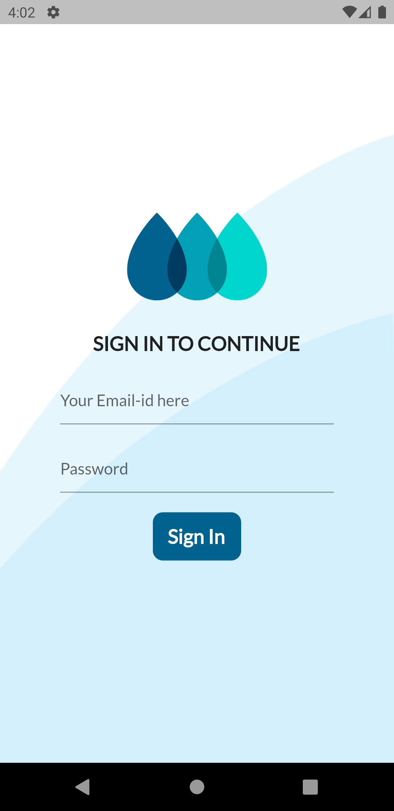
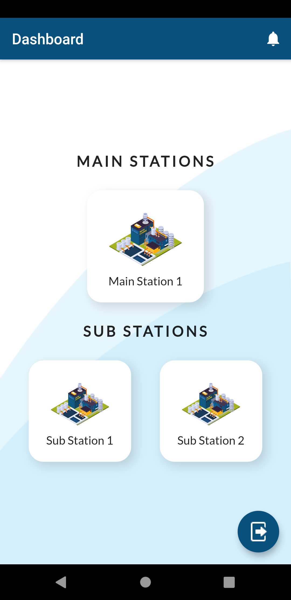
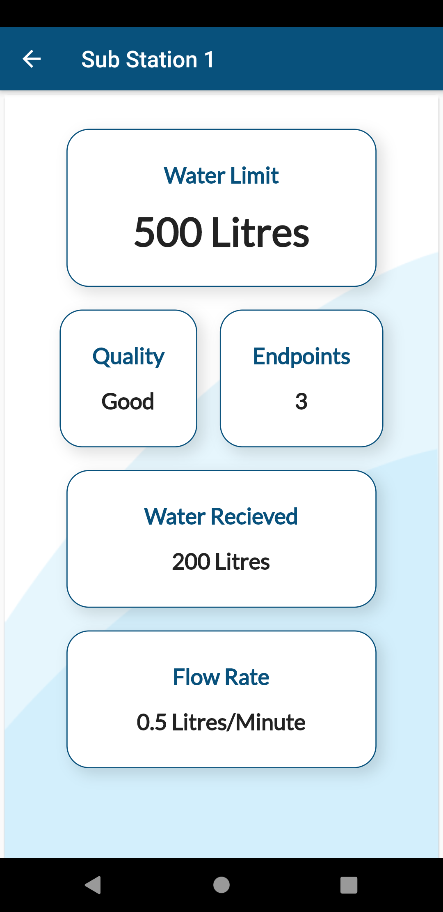

# wat_monitor 💧

A Flutter IoT app to monitor equal distribution, leakages, water quality and to notify accordingly.

## Concepts used 📑

- Firebase Auth
- Firebase Realtime database
- Flutter

## Feautures 💎

- Realtime Dashboard
- Realtime water quality
- Quality notifications
- Leakage notification
- Secure access using Firebase Authentication

## Screens 📱

- Sign in
- HomePage
- Station Info
- Notifications

## Sign In Page

 

## Homepage

## Station Dashboard

